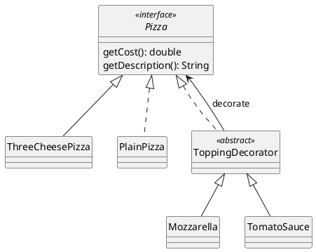

# Patron décorateur Pizza
référence: http://www.newthinktank.com/2012/09/decorator-design-pattern-tutorial/

```plantuml
@startuml
skinparam Style strictuml
Interface Pizza <<interface>>{
    getCost(): double
    getDescription(): String
}
class ThreeCheesePizza extends Pizza
class PlainPizza implements Pizza
class ToppingDecorator <<abstract>> implements Pizza 
class Mozzarella extends ToppingDecorator
class TomatoSauce extends ToppingDecorator
ToppingDecorator --> Pizza: decorate
@enduml
```
