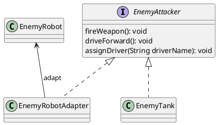

# Enemy Attacker Adapter Pattern

```plantuml
@startuml
 interface EnemyAttacker {
	fireWeapon(): void
	driveForward(): void
	assignDriver(String driverName): void
}
class EnemyRobot
class EnemyRobotAdapter implements EnemyAttacker
class EnemyTank implements EnemyAttacker
EnemyRobotAdapter  -up-> EnemyRobot: adapt

@enduml
```
