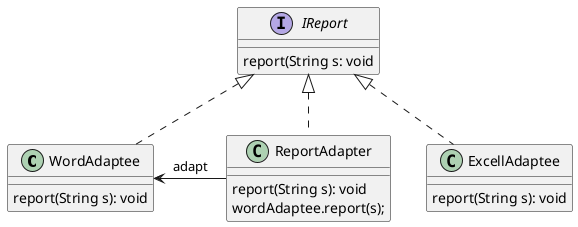
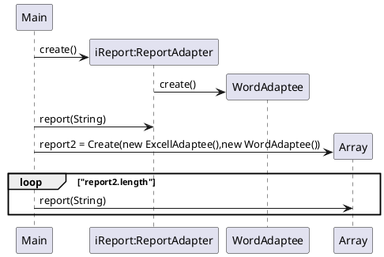

Patron Adaptateur

Générer le diagramme de classe correspondant à ce code.

```plantuml
@startuml
skinparam style strict
class WordAdaptee implements IReport {
     report(String s): void
}

class ExcellAdaptee implements IReport {
     report(String s): void
}


class ReportAdapter implements IReport {
     report(String s): void
        wordAdaptee.report(s);
}
ReportAdapter -left-> WordAdaptee: adapt

interface IReport {
     report(String s: void
}


@enduml
```

```plantuml
@startuml
participant Main
participant "iReport:ReportAdapter" as ReportAdapter

Main -> ReportAdapter**: create()
ReportAdapter -> WordAdaptee**: create()
Main -> ReportAdapter: report(String)
Main -> Array**:report2 = Create(new ExcellAdaptee(),new WordAdaptee())
loop "report2.length"
    Main -> Array: report(String)
end


@enduml
```

Results will be:

Trial report1 with one adaptee Word
Trial report 2 Excel
Trial report 2 Word