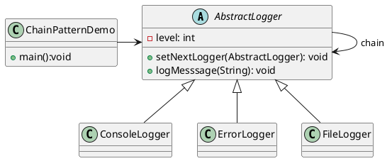

# Logger utilisant le patron Chaine de Responsabilité
https://www.tutorialspoint.com/design_pattern/chain_of_responsibility_pattern.htm

```plantuml
@startuml
skinparam style strict

abstract class AbstractLogger {
  -level: int
  +setNextLogger(AbstractLogger): void
  +logMesssage(String): void
}
class ChainPatternDemo {
  +main():void
}
class ConsoleLogger extends AbstractLogger
class ErrorLogger extends AbstractLogger 
class FileLogger extends AbstractLogger 

AbstractLogger -> AbstractLogger: chain
ChainPatternDemo -> AbstractLogger

@enduml
```
