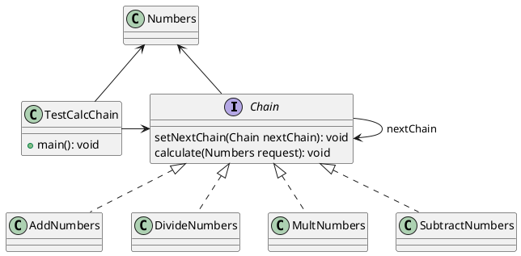

# Chaine de responsabilité
http://www.newthinktank.com/2012/10/chain-of-responsibility-design-pattern-tutorial/

```plantuml
@startuml
skinparam style strict
interface Chain {
	setNextChain(Chain nextChain): void
	calculate(Numbers request): void
	
}
class AddNumbers implements Chain
class DivideNumbers implements Chain
class MultNumbers implements Chain
class Numbers 

class SubtractNumbers implements Chain
class TestCalcChain {
  +main(): void
}

TestCalcChain -> Chain
TestCalcChain -up-> Numbers
Chain -> Numbers
Chain -> Chain: nextChain
@enduml
```