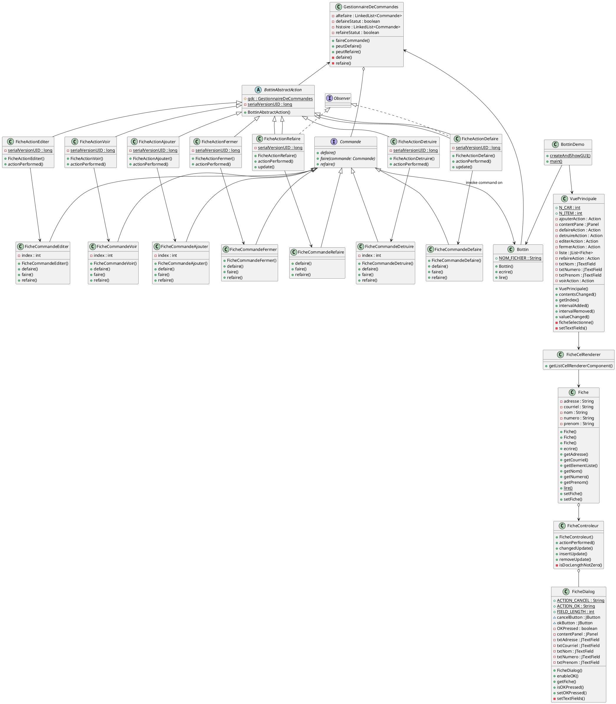

# Bottin
Diagramme de Classe UML du package Bottin

Voila comment je pense que le pattern command s'articule

Invoker = GestionnaireDeCommandes
Client = Bottin
Receiver = Vue Principale

Helwan Mandé 

