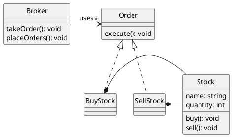

Patron Commande

```plantuml
@startuml
skinparam style strictuml

class Order{
  execute(): void
}

class Stock{
  name: string
  quantity: int
  buy(): void
  sell(): void
}

class Broker{
  takeOrder(): void
  placeOrders(): void
}
class BuyStock implements Order
class SellStock implements Order

BuyStock *- Stock
SellStock *- Stock
Broker -> "*" Order: uses

@enduml
```

