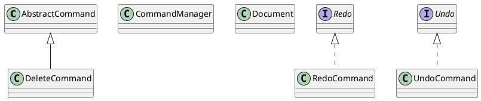

```plantuml
@startuml
class AbstractCommand
class CommandManager
class DeleteCommand extends AbstractCommand

class Document
interface Redo
class RedoCommand implements Redo
interface Undo
class UndoCommand implements Undo

@enduml
```