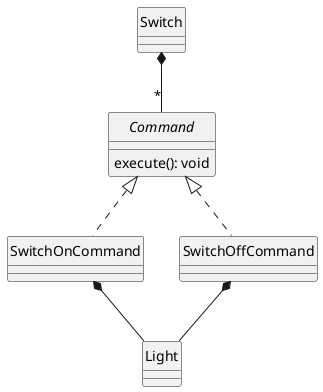

Commandes pour Switch light on/off

```plantuml
@startuml
skinparam style strictuml
interface Command{
  execute(): void
}

class Switch
Class Light
class SwitchOnCommand implements Command
class SwitchOffCommand implements Command
SwitchOnCommand *-- Light
SwitchOffCommand *-- Light
Switch *-- "*" Command

@enduml
```

