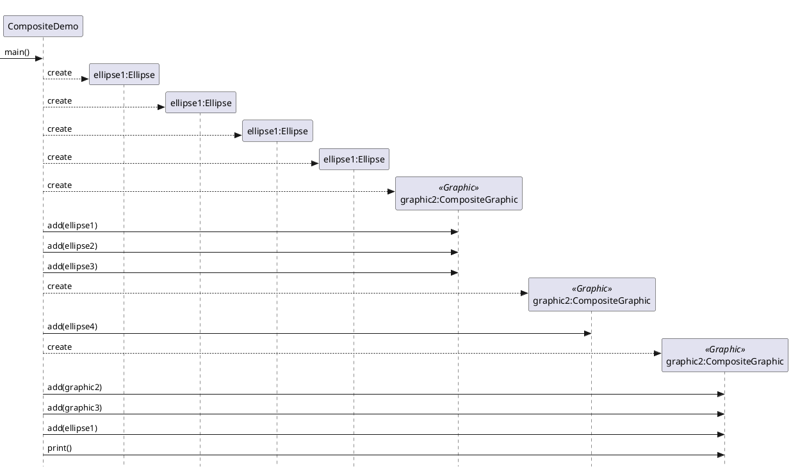

 ```plantuml
@startuml
skinparam style strictuml
interface Graphic {
  print(): void 
}
class Ellipse implements Graphic{
    print(): void 
}
class CompositeGraphic implements Graphic{
      print(): void 

}
CompositeGraphic *-- Graphic : composed of 
@enduml
```

