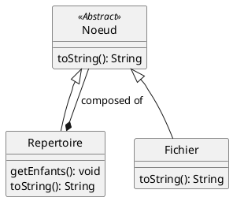

# Composite

```plantuml
@startuml
skinparam style strictuml
class Noeud <<Abstract>>{
  toString(): String
}
class Repertoire {
  getEnfants(): void
  toString(): String
}
class Fichier{
    toString(): String
}
class Fichier extends Noeud
class Repertoire extends Noeud
Repertoire *-- Noeud: composed of

@enduml
```

