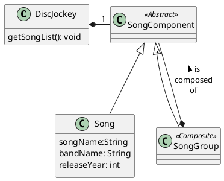

# Quiz3 - Patron composite et Test unitaires
1. Convertir SongListGenerator en fonction de test
2. Utiliser ```mvn -P jacoco test``` pour générer le rapport de couverture de test
3. Consulter le rapport de test dans ```./target/site/jacoco/index.html```
4. Objectif: Avoir une couverture de test de 100%
5. Vous pouvez utiliser Utils/OutStream pour tester le contenu de la console
6. Assurez vous de tester adéquatement la classe Abstraite SongComponent. C'est a dire de générer les exceptions de chaque fonction.
7. En mode TDD, ajouter le test suivant dans DiskJockeyTest, assertEquals(7,diskJockey.numberOfSong()) qui doit vérifier le nombre de chanson.




