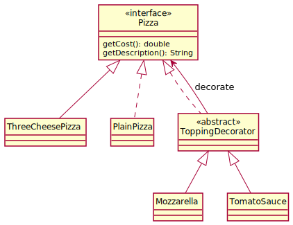

# Décorateur Pizza

## Table de correspondance
|Nom dans le modèle de conception | Nom actuel |
|-|-|
|Component| |
|ConcreteComponent| |
|Decorator| |
|method()| |
# Diagramme de classe

## Diagramme de séquence

référence: http://www.newthinktank.com/2012/09/decorator-design-pattern-tutorial/
