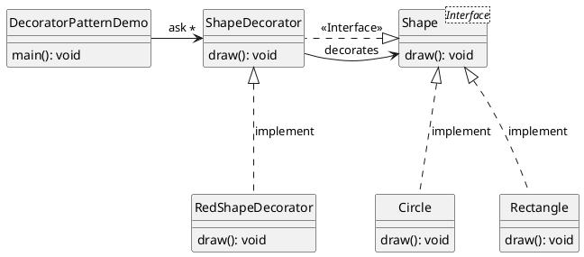

# Patron Décorateur
référence: https://www.tutorialspoint.com/design_pattern/decorator_pattern.htm

```plantuml
@startuml
skinparam Style Strictuml
class Shape <Interface>{
draw(): void
}
class Circle{
draw(): void
}
class Rectangle{
draw(): void
}
class ShapeDecorator{
draw(): void
}
Class RedShapeDecorator{
draw(): void
}
class DecoratorPatternDemo{
    main(): void
}
DecoratorPatternDemo -right-> "*" ShapeDecorator: ask
ShapeDecorator .-left-|> Shape: <<Interface>>  
Circle .-up-|> Shape: implement
Rectangle .-up-|> Shape: implement

RedShapeDecorator  .-up-|> ShapeDecorator: implement
ShapeDecorator --> Shape:  decorates


@enduml
```