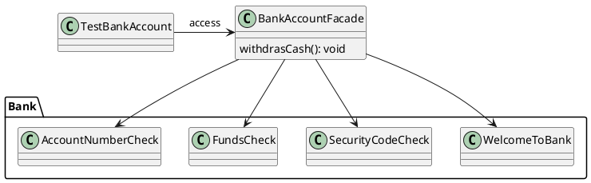

@ Patron facade Bank

```plantuml
@startuml
skinparam style strict

package Bank {
class AccountNumberCheck
class FundsCheck
class SecurityCodeCheck 
class WelcomeToBank
}

class TestBankAccount 

class BankAccountFacade {
  
  withdrasCash(): void

}
BankAccountFacade --> WelcomeToBank
BankAccountFacade --> AccountNumberCheck
BankAccountFacade --> SecurityCodeCheck
BankAccountFacade --> FundsCheck

TestBankAccount -> BankAccountFacade: access

@enduml
```