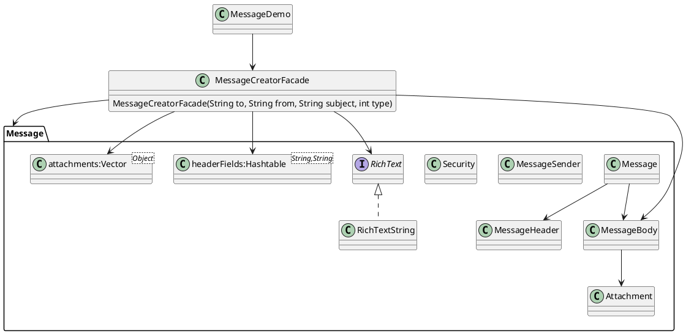

# Patron facade Messages

```plantuml
@startuml
skinparam style strict7
package Message {
class Attachment 
class Message 
class MessageBody
class MessageHeader
class MessageSender 
class Security
interface RichText
class RichTextString implements RichText 

class "headerFields:Hashtable<String,String>" AS headerFields
class "attachments:Vector<Object>" as attachments

Message --> MessageHeader
Message --> MessageBody
MessageBody --> Attachment
}

class MessageCreatorFacade {
  MessageCreatorFacade(String to, String from, String subject, int type)
}
MessageCreatorFacade --> RichText
MessageCreatorFacade --> attachments
MessageCreatorFacade -down-> MessageBody
MessageCreatorFacade --> Message
MessageCreatorFacade --> headerFields

MessageDemo --> MessageCreatorFacade

@enduml
```