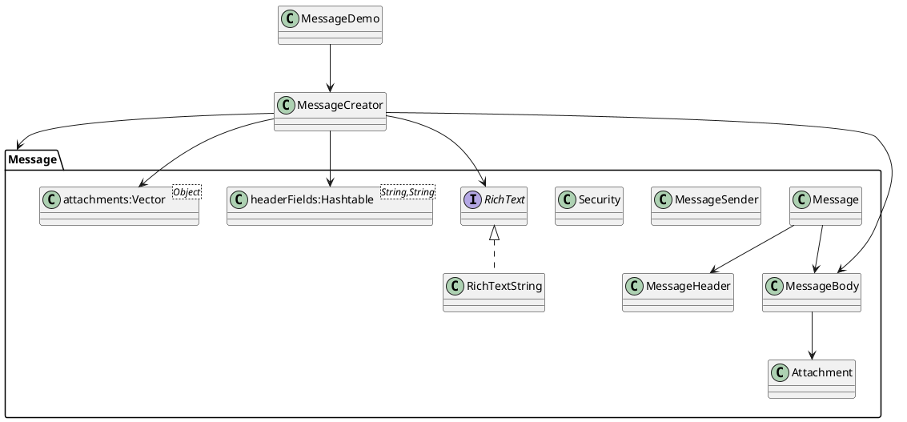

# Patron facade Messages

```plantuml
@startuml
skinparam style strict7
package Message {
class Attachment 
class Message 
class MessageBody
class MessageHeader
class MessageSender 
class Security
interface RichText
class RichTextString implements RichText 

class "headerFields:Hashtable<String,String>" AS headerFields
class "attachments:Vector<Object>" as attachments

Message --> MessageHeader
Message --> MessageBody
MessageBody --> Attachment
}

class MessageCreator
MessageCreator --> RichText
MessageCreator --> attachments
MessageCreator -down-> MessageBody
MessageCreator --> Message
MessageCreator --> headerFields

MessageDemo --> MessageCreator

@enduml
```