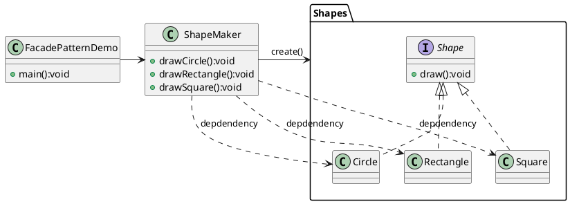

# Patron Facade

https://www.tutorialspoint.com/design_pattern/facade_pattern.htm

```plantuml
@startuml
skinparam style strict
class FacadePatternDemo {
  +main():void
}

class ShapeMaker{
  +drawCircle():void
  +drawRectangle():void
  +drawSquare():void
}

package Shapes {
  interface Shape{
    +draw():void
  }

  class Circle implements Shape
  class Rectangle implements Shape
  class Square implements Shape
}
FacadePatternDemo -> ShapeMaker
ShapeMaker -> Shapes: create()

ShapeMaker .right->Circle: depdendency
ShapeMaker .right.>Rectangle: depdendency
ShapeMaker .right.>Square: depdendency

@enduml

```