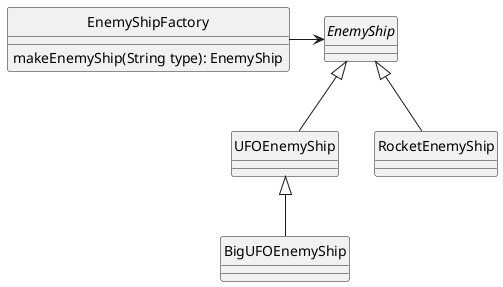

[Factory Design pattern tutorial from Derek Banas](http://www.newthinktank.com/2012/09/factory-design-pattern-tutorial/
)

```plantuml
@startuml
skinparam style strictuml
 abstract class EnemyShip
 class UFOEnemyShip extends EnemyShip
class RocketEnemyShip extends EnemyShip 
class BigUFOEnemyShip extends UFOEnemyShip
class EnemyShipFactory {
  makeEnemyShip(String type): EnemyShip
}
EnemyShipFactory -right->EnemyShip


@enduml
```