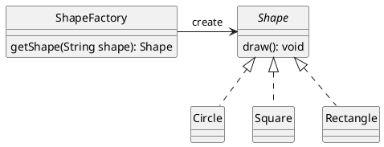

[Factory pattern from TutorialsPoint.com](https://www.tutorialspoint.com/design_pattern/factory_pattern.htm)

```plantuml
@startuml
skinparam style strictuml

interface Shape {
  draw(): void
}

class Circle implements Shape
class Square implements Shape
class Rectangle implements Shape

Class ShapeFactory{
  getShape(String shape): Shape
}

ShapeFactory -right-> Shape: create

@enduml
```