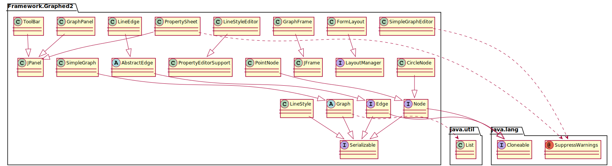

# Framework

# Diagramme de classe initial

# Diagramme de classe modifié

Il manque encore quelque dépendances....

## Utilitaires
- Commande pour générer le diagramme initial
    - java -jar plantuml-dependency-cli-1.4.0-jar-with-dependencies.jar -o src/main/java/Framework/Graphed2/README-generated.puml -b . -i **/Graphed2/**/*.java  -v
