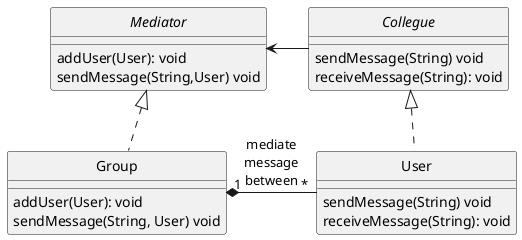

# Chat Application using Mediator Pattern

```plantuml
@startuml
skinparam style strictuml

interface Mediator {
  addUser(User): void
  sendMessage(String,User) void
}

interface Collegue {
  sendMessage(String) void
  receiveMessage(String): void

}

class User implements Collegue {
  sendMessage(String) void
  receiveMessage(String): void
}

class Group implements Mediator {
    addUser(User): void
  sendMessage(String, User) void
}

Collegue -left-> Mediator
Group "1" *- "*" User: mediate\nmessage\nbetween


@enduml
```