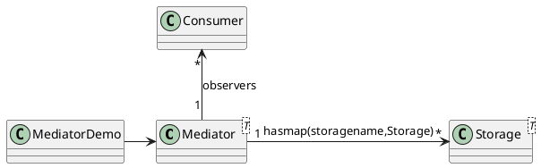
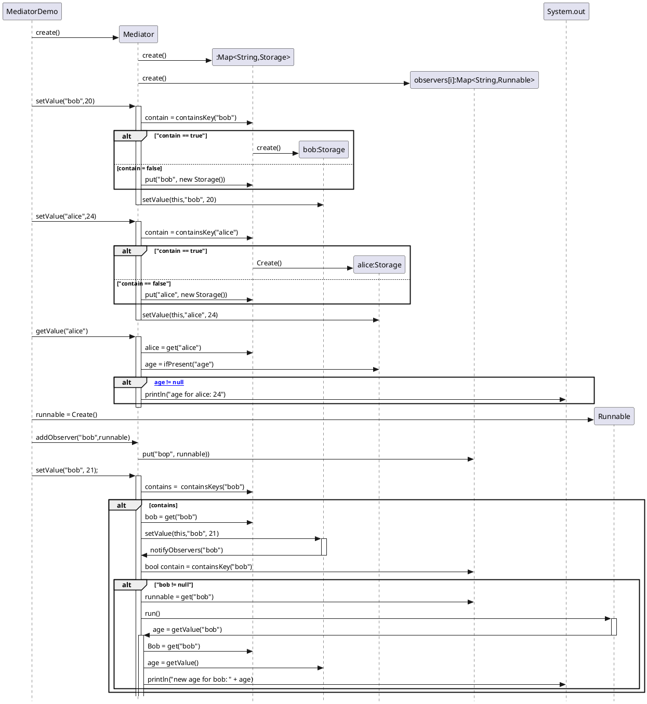

# Patron Médiateur avec intégration Observateur

```plantuml
@startuml
class Mediator<T>
class Storage<T> 
class MediatorDemo 

Mediator "1" -right->  "*" Storage: hasmap(storagename,Storage)
MediatorDemo -right-> Mediator
Mediator "1" -up-> "*" Consumer: observers
@enduml
```

```plantuml
@startuml
skinparam style strictuml
participant MediatorDemo 
participant Mediator
participant ":Map<String,Storage>" as MSS
participant "bob:Storage" as Bob
participant "alice:Storage" as Alice
participant "observers[i]:Map<String,Runnable>" as Observers

MediatorDemo -> Mediator**: create()
Mediator -> MSS**: create()
Mediator -> Observers**: create()
MediatorDemo -> Mediator: setValue("bob",20)
activate Mediator
Mediator -> MSS: contain = containsKey("bob")
alt "contain == true"
  MSS -> Bob**: create()
else contain = false
Mediator -> MSS: put("bob", new Storage())
end
Mediator -> Bob: setValue(this,"bob", 20)
deactivate Mediator

MediatorDemo -> Mediator: setValue("alice",24)
activate Mediator
Mediator -> MSS: contain = containsKey("alice")
alt "contain == true"
  MSS -> Alice**: Create()
  else "contain == false"
  Mediator -> MSS: put("alice", new Storage())
end
Mediator -> Alice: setValue(this,"alice", 24)
deactivate Mediator

MediatorDemo-> Mediator: getValue("alice")
activate Mediator
Mediator -> MSS: alice = get("alice")
Mediator -> Alice: age = ifPresent("age")
alt ["age != null"]
Mediator -> System.out: println("age for alice: 24")
end
deactivate Mediator

MediatorDemo -> Runnable**: runnable = Create()
MediatorDemo -> Mediator: addObserver("bob",runnable) 
Mediator -> Observers: put("bop", runnable))

MediatorDemo->Mediator: setValue("bob", 21);
activate Mediator

Mediator -> MSS: contains =  containsKeys("bob")
alt contains
Mediator -> MSS: bob = get("bob")
Mediator -> Bob: setValue(this,"bob", 21)
activate Bob
Bob -> Mediator: notifyObservers("bob")
deactivate Bob
Mediator -> Observers: bool contain = containsKey("bob")
alt "bob != null"
Mediator -> Observers: runnable = get("bob")
Mediator -> Runnable: run()
activate Runnable
Mediator <- Runnable: age = getValue("bob")
deactivate Runnable
activate Mediator
Mediator -> MSS: Bob = get("bob")
Mediator -> Bob: age = getValue()
Mediator -> System.out: println("new age for bob: " + age)
end
end


@enduml
```