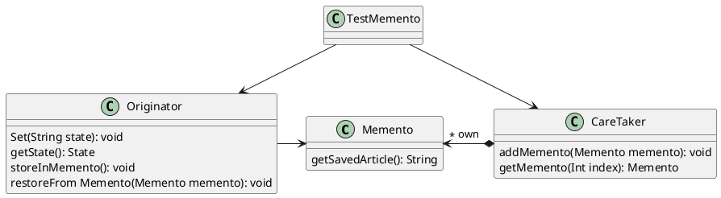

[Derek Banas  Memento Design pattern Tutorial](http://www.newthinktank.com/2012/10/memento-design-pattern-tutorial/)

```plantuml
@startuml
class Memento {
  getSavedArticle(): String
}

class Originator {
  Set(String state): void
  getState(): State
  storeInMemento(): void
  restoreFrom Memento(Memento memento): void
}

class CareTaker{
  addMemento(Memento memento): void
  getMemento(Int index): Memento
}

CareTaker *-left-> "*" Memento : own
Originator -> Memento

TestMemento --> CareTaker
TestMemento --> Originator
@enduml
```