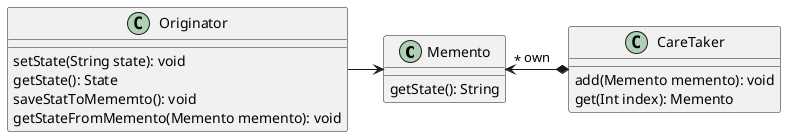

[Design Patterns - Mememto from tutorialspoint.com](https://www.tutorialspoint.com/design_pattern/memento_pattern.htm)

```plantuml
@startuml
class Memento {
  getState(): String
}

class Originator {
  setState(String state): void
  getState(): State
  saveStatToMememto(): void
  getStateFromMemento(Memento memento): void
}

class CareTaker{
  add(Memento memento): void
  get(Int index): Memento
}

CareTaker *-left-> "*" Memento : own
Originator -> Memento

@enduml
```