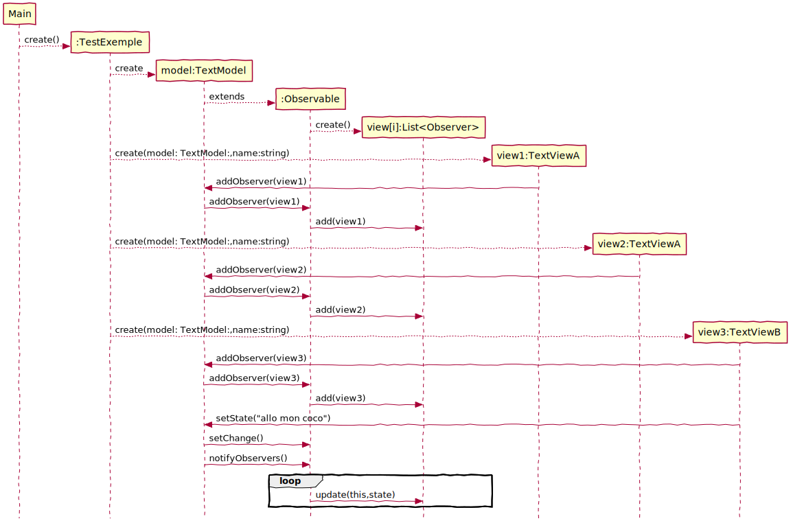

# Chat with multiple dialog using Observer pattern
# Table de correspondance

|Nom dans le modèle de conception | Nom actuel |
|-|-|
|Sujet| TextModel|            
|Observer| Observer|
|ConcreteObserver| TextViewA, TextViewB   |
|attach()| addObserver(Observer)|
|notify()| update(Observable, Object)|

# Diagramme de classe

# Diagramme de séquence
