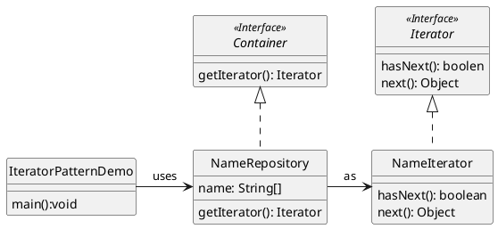

# Container iterator

```plantuml
@startuml
skinparam style strictuml
interface Container <<Interface>> {
  getIterator(): Iterator
}
interface Iterator <<Interface>> {
  hasNext(): boolen
  next(): Object
}
class NameRepository{
  name: String[]
  getIterator(): Iterator
}
class NameIterator{
  hasNext(): boolean
  next(): Object
}
class IteratorPatternDemo{
  main():void
}
class NameRepository implements Container 
class NameIterator implements Iterator  
IteratorPatternDemo -> NameRepository : uses
NameRepository -> NameIterator : as

@enduml
```