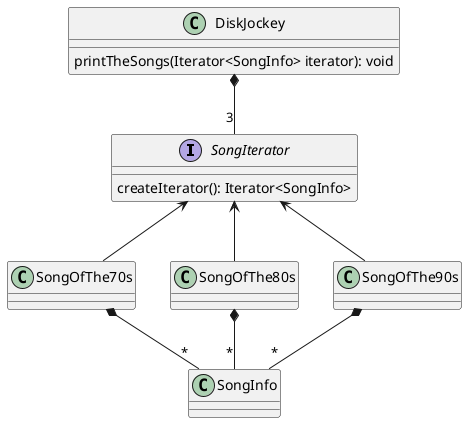

# Patron Itérateur

```plantuml
@startuml
interface SongIterator {
  createIterator(): Iterator<SongInfo>
}
class DiskJockey{
  printTheSongs(Iterator<SongInfo> iterator): void
}
class SongOfThe70s
SongOfThe70s-up->SongIterator
SongOfThe80s-up->SongIterator
SongOfThe90s-up->SongIterator

DiskJockey *-- "3" SongIterator

SongOfThe70s*-down- "*" SongInfo
SongOfThe80s*-down- "*" SongInfo
SongOfThe90s *-down- "*" SongInfo
@enduml


```