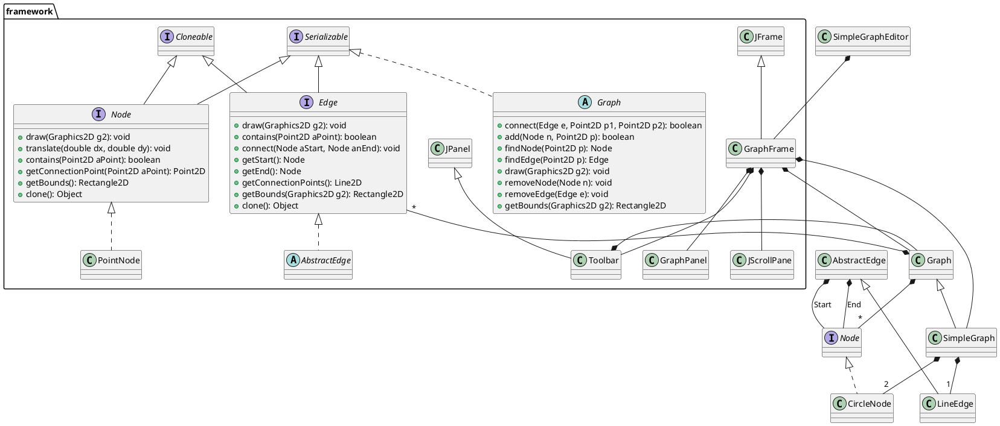

# Patron prototype

```plantuml
@startuml

package framework {
    abstract class AbstractEdge implements Edge
    interface Edge extends Serializable, Cloneable {
        +draw(Graphics2D g2): void
        +contains(Point2D aPoint): boolean
        +connect(Node aStart, Node anEnd): void
        +getStart(): Node
        +getEnd(): Node
        +getConnectionPoints(): Line2D
        +getBounds(Graphics2D g2): Rectangle2D
        +clone(): Object
    }
    abstract class Graph implements Serializable {
        +connect(Edge e, Point2D p1, Point2D p2): boolean
        +add(Node n, Point2D p): boolean
        +findNode(Point2D p): Node
        +findEdge(Point2D p): Edge
        +draw(Graphics2D g2): void
        +removeNode(Node n): void
        +removeEdge(Edge e): void
        +getBounds(Graphics2D g2): Rectangle2D
    }
    class GraphFrame extends JFrame
    interface Node extends Serializable, Cloneable {
        +draw(Graphics2D g2): void
        +translate(double dx, double dy): void
        +contains(Point2D aPoint): boolean
        +getConnectionPoint(Point2D aPoint): Point2D
        +getBounds(): Rectangle2D
        +clone(): Object
    }
    class PointNode implements Node
    class Toolbar extends JPanel
    class GraphPanel
    class JScrollPane
}

class SimpleGraphEditor
class SimpleGraph extends Graph
class CircleNode implements Node
class LineEdge extends AbstractEdge


Toolbar *-- Graph
Graph *-- "*" Node
Graph *-- "*" Edge
GraphFrame *-- SimpleGraph
SimpleGraph *-- "2" CircleNode
SimpleGraph *-- "1" LineEdge
AbstractEdge *-- Node: Start
AbstractEdge *-- Node: End
SimpleGraphEditor *-- GraphFrame
GraphFrame *-- Graph
GraphFrame *-- GraphPanel
GraphFrame *-- Toolbar
GraphFrame *-- JScrollPane
@enduml
```