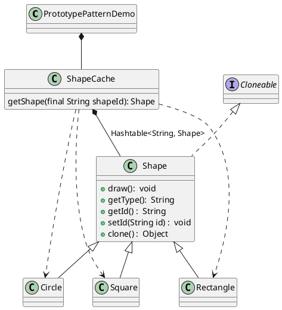

# Patron Prototype

```plantuml
@startuml
class PrototypePatternDemo
class Circle extends Shape
class Rectangle extends Shape 
 class Shape implements Cloneable {
   +draw():  void
   +getType():  String
   +getId() :  String
   +setId(String id) :  void
   +clone() :  Object
  }
  class Square extends Shape 
  Class ShapeCache {
    getShape(final String shapeId): Shape 
  }

ShapeCache ..> Circle
ShapeCache ..> Rectangle
ShapeCache ..> Square
PrototypePatternDemo *-- ShapeCache
ShapeCache *-- Shape: Hashtable<String, Shape>
@enduml
```