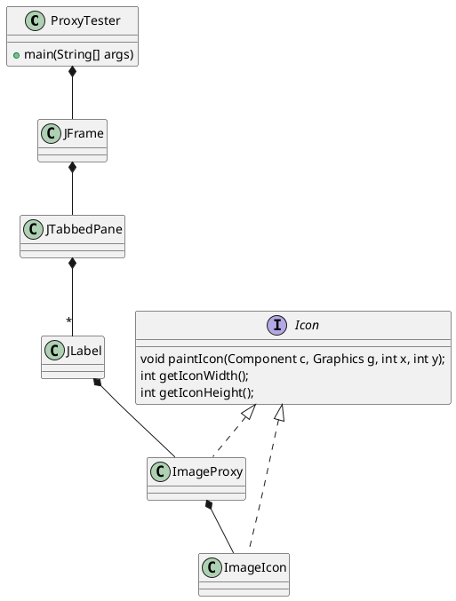

# Patron Proxy Images

```plantuml
@startuml

class ProxyTester {
   +main(String[] args)
   }
class JTabbedPane
class JFrame

ProxyTester *-- JFrame
JFrame *-- JTabbedPane
JTabbedPane *-- "*" JLabel

interface  Icon {
     void paintIcon(Component c, Graphics g, int x, int y);
    int getIconWidth();
    int getIconHeight();
}
class ImageProxy implements Icon 
JLabel *-- ImageProxy

class ImageIcon implements Icon

ImageProxy *-- ImageIcon


@enduml
```