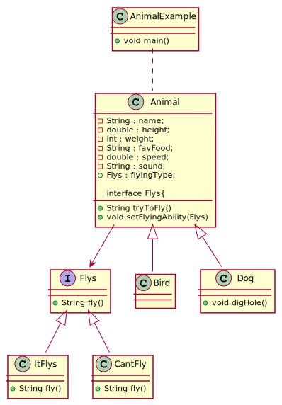
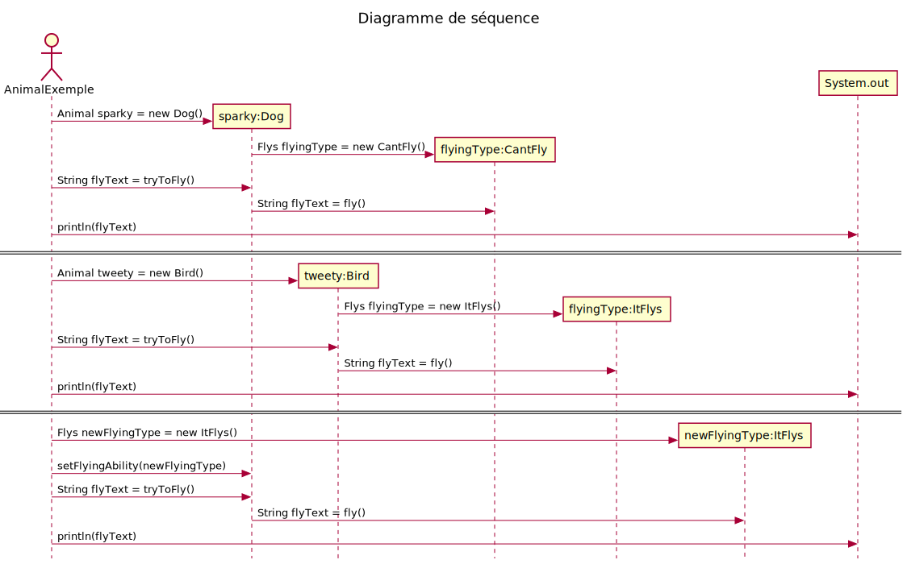

# Table de correspondance

|Nom dans le  modèle de conception | Nom actuel |
|-|-|
|Context| Animal |
|Strategy| Flys |
|ConcreteStrategy| ItFlys, CantFly |
|doWork()| fly() |

# Diagramme de classe

Suggestion pour améliorer la solution
IStrategyFlys
StrategyCantFly
StrategyItFly

# Diagramme de séquence
