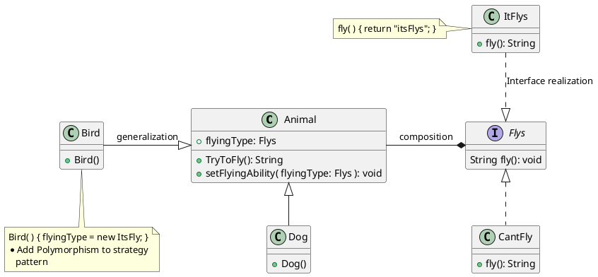

# Patron Strategy - Animal

```plantuml
@startuml

class Animal{
    + flyingType: Flys
    + TryToFly(): String
    + setFlyingAbility( flyingType: Flys ): void
}
class Bird {
+Bird()
}
class Dog extends Animal {
+Dog()
}
class ItFlys{
    + fly(): String
}
class CantFly implements Flys{
    + fly(): String
}


interface Flys{
    String fly(): void
}

ItFlys ..|> Flys : Interface realization
Animal -* Flys:composition
Bird -|> Animal :generalization

note bottom of Bird : Bird( ) { flyingType = new ItsFly; }\n*Add Polymorphism to strategy\n   pattern

note left of ItFlys : fly( ) { return "itsFlys"; }

@enduml
```
