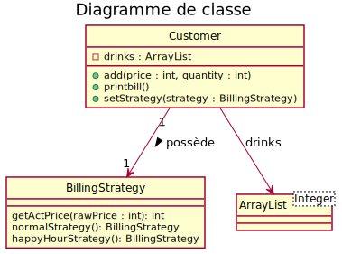
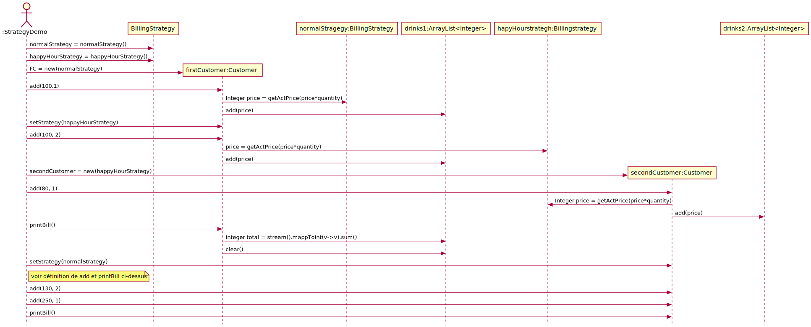

# Table de correspondance

|Nom dans le  modèle de conception | Nom actuel |
|-|-|
|Context| drinks |
|Strategy| BillinStrategy |
|ConcreteStrategy| normalStrategy(), happyHourStrategy() |
|doWork()| Opération polymorphe|

# Diagramme de classe

# Diagramme de séquence

# Questions auxquels il faut répondre
- Comment et quand applique t'on les stratégies
- Détail de printBill