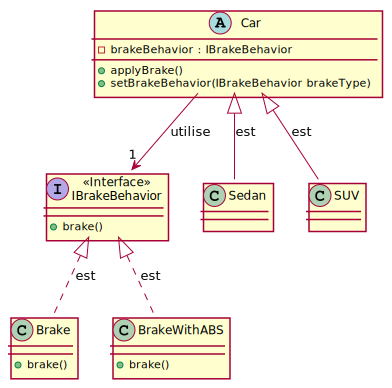
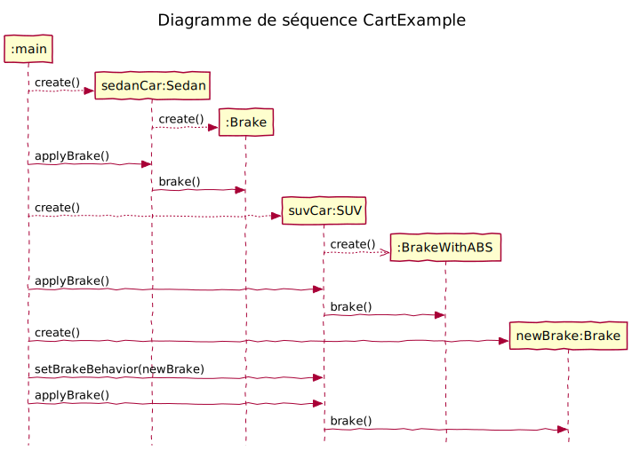

# Table de correspondance

|Nom dans le  modèle de conception | Nom actuel |
|-|-|
|Context| N/A |
|Strategy|IBrakeBehavior |
|ConcreteStrategy| Brake, BrakeWithABS |
|doWork()|  brake() |

# Diagramme de classe

# Diagramme de séquence

