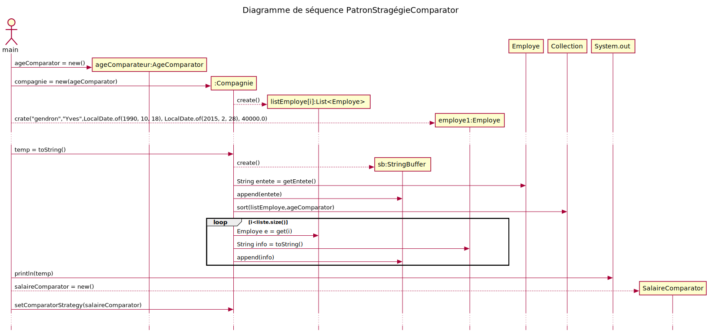

# Patron stratégie Comparateur
# Table de correspondance

|Nom dans le  modèle de conception | Nom actuel |
|-|-|
|Context| list<Employe> |
|Strategy| Comparator<Employe>|
|ConcreteStrategy| PrenomComparator, SalaireComparator, AgeComparator, EmbaucheCoomparator |
|doWork()| compare(o1:Employ, o2:Employe): int|

# Diagramme de classe

# Diagramme de séquence

