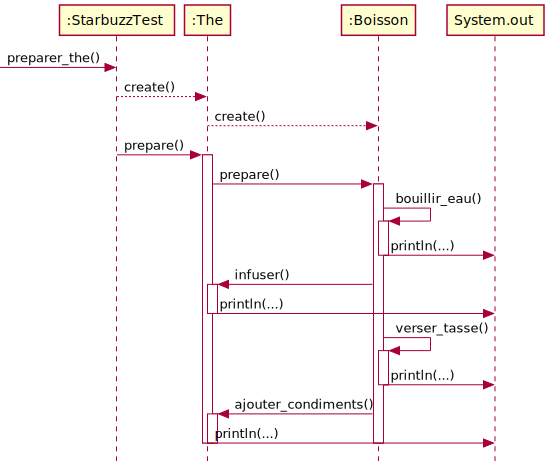

# TEMPLATE METHODE

## table de correspondance
|Nom dans le modèle de conception | Nom actuel |
|-|-|
|AbstractClass| Boisson|
|ConcreteClass| The,  Cafe | 
|templateMethod| preparer() | 
|primitiveOperation()| infuser(),  ajouter_condiments() |

# Diagramme de classe

# Diagramme de séquence

- remplacer la classe The par Café pour voir comment se comport la classe Cafe.
