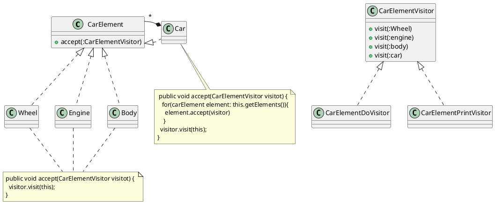

# Patron Visiteur 
https://en.wikipedia.org/wiki/Visitor_pattern#Sources

```plantuml
@startuml
class CarElement {
  +accept(:CarElementVisitor)
  }
  class Wheel implements CarElement
  class Engine implements CarElement
  class Body implements CarElement
  class Car implements CarElement
  note as AE
    public void accept(CarElementVisitor visitot) { 
      visitor.visit(this);
    }
  end note
  Wheel .. AE
  Engine .. AE
  Body .. AE

  note bottom of Car
     public void accept(CarElementVisitor visitot) {
       for(carElement element: this.getElements()){
         element.accept(visitor)
        } 
      visitor.visit(this);
    }
  end note

  class CarElementVisitor {
    +visit(:Wheel)
    +visit(:engine)
    +visit(:body)
    +visit(:car)
  }

  class CarElementDoVisitor implements CarElementVisitor
  class CarElementPrintVisitor implements CarElementVisitor

Car *- "*" CarElement


@enduml
```