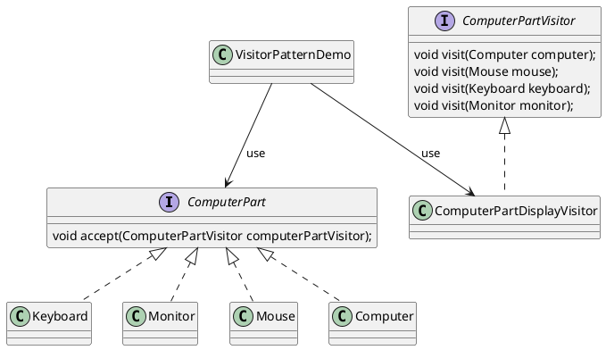

# Patron Visiteur 
## Pièces d'ordinateur

https://www.tutorialspoint.com/design_pattern/visitor_pattern.htm

```plantuml
@startuml

interface ComputerPart {
   void accept(ComputerPartVisitor computerPartVisitor);
}
class Keyboard implements ComputerPart 
class Monitor implements ComputerPart 
class Mouse implements ComputerPart 
class Computer implements ComputerPart 
interface ComputerPartVisitor {
	void visit(Computer computer);
	void visit(Mouse mouse);
	void visit(Keyboard keyboard);
	void visit(Monitor monitor);
}
class ComputerPartDisplayVisitor implements ComputerPartVisitor 
class VisitorPatternDemo 

VisitorPatternDemo --> ComputerPartDisplayVisitor: use
VisitorPatternDemo --> ComputerPart: use
@enduml
```