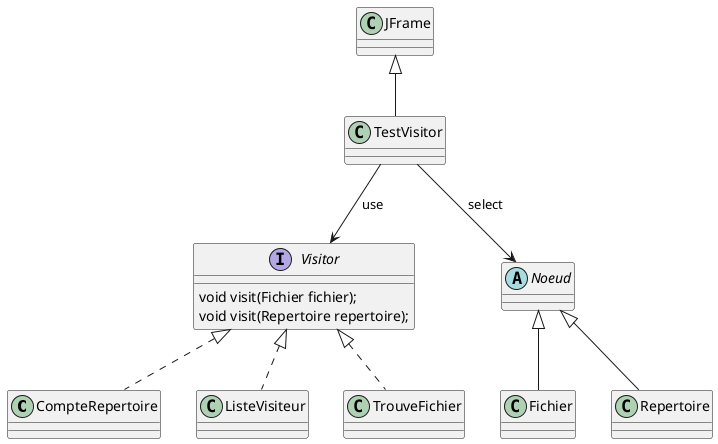

# Visitor
Exemple du patron Visiteur
https://github.com/lacasse4/Visitor

```plantuml
@startuml
class CompteRepertoire implements Visitor {}
class Fichier extends Noeud {}
class ListeVisiteur implements Visitor {}
abstract class Noeud {}
class Repertoire extends Noeud {}
class TestVisitor extends JFrame {}
class TrouveFichier implements Visitor{}
interface Visitor {	
   void visit(Fichier fichier);
	 void visit(Repertoire repertoire);
}

TestVisitor --> Noeud: select 
TestVisitor --> Visitor : use


@enduml
```